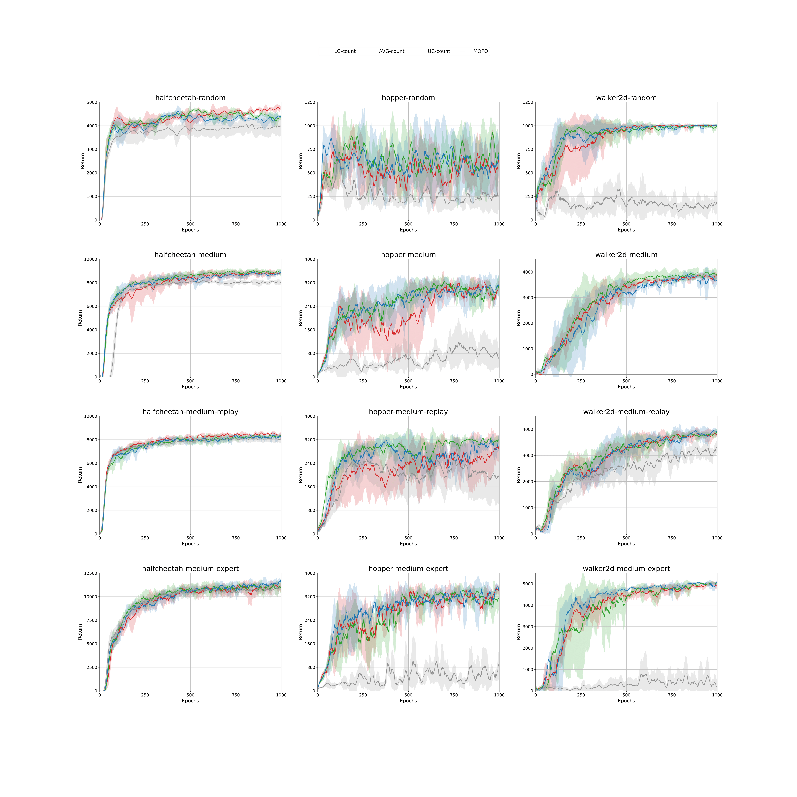

#  Count-MORL 

The official repository for <[Model-based offline Reinforcement Learning with Count-based Conservatism](https://github.com/bckim97/Count-MORL)> (Kim & Oh, ICML 2023)

> Count-MORL is a novel approach to model-based offline RL, which incorporates count-based conservatism by adding a reward penalty proportional to the inverse-square-root of the frequency of state-action pairs.
  Our work is the first to demonstrate that count-based conservatism, combined with a non-trivial adaptation to offline deep RL, effectively bridges the gap between theoretical claims and practical applications.

# Dependencies

- MuJoCo 2.1.0
- Gym 0.22.0
- D4RL : [github.com/Farama-Foundation/D4RL](https://github.com/Farama-Foundation/D4RL)
- PyTorch 1.11.0
- TensorFlow 2.9.1

# Usage

## Train

```
# for halfcheetah-random-v2 with LC count
python train.py --task "halfcheetah-random-v2" --rollout-length 5 --reward-penalty-coef 1.0 --bit 50 --cnt_type "LC" --cnt_coef 0.5 --use_count "True"
# for walker2d-medium-v2 with AVG count
python train.py --task "walker2d-medium-v2" --rollout-length 20 --reward-penalty-coef 3.0 --bit 32 --cnt_type "AVG" --cnt_coef 0.5 --use_count "True"
# for hopper-medium-replay-v2 with UC count
python train.py --task "hopper-medium-replay-v2" --rollout-length 5 --reward-penalty-coef 1.0 --bit 50 --cnt_type "UC" --cnt_coef 0.5 --use_count "True"
```
> If the argument of use_count is false, you can implement the MOPO algorithm. 

## Plot

```
python plotter.py --root-dir "log" --task "halfcheetah-random-v2"
```

# Results
All experiments were run for 5 random seeds each and learning curves are smoothed by averaging over a window of 10 epochs.

### MuJoCo-v2




# Reference

- Official implementation of MOPO in tensorflow : [github.com/tianheyu927/mopo](https://github.com/tianheyu927/mopo) 
- Re-implementation of MOPO in pytorch : [github.com/yihaosun1124/pytorch-mopo](https://github.com/yihaosun1124/pytorch-mopo)
- Hash code : [github.com/openai/EPG/blob/master/epg/exploration.py](https://github.com/openai/EPG/blob/master/epg/exploration.py)
